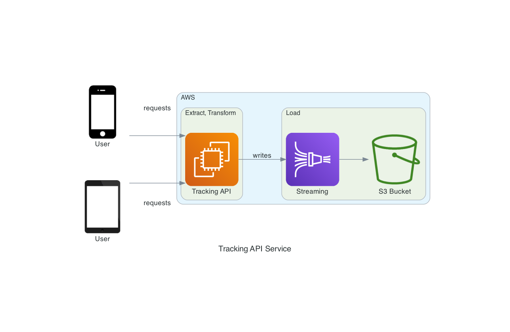

# API_Kinesis_S3

It was my first time dealing with all used technologies and tools involved since Cloud service providers, APIs, HTTPs Server, and so on.

The first approach was to learn how the architecture should work to later develop each partition individually, as I was searching and filtering information I was trying to adjudicate to the challenge to try to grant it as quickly as possible. I immediately realized that it was going to take a little longer than I had initially thought.

### Project architecture

## EC2 deploy:

Started by developing AWS EC2 using terraform and Ansible to automate the process of creating the virtual machine on AWS. The terraform is used to define the characteristics and rules of our virtual machine (security group, VPC, ingress/egress ports, protocols, CIDR etc...). Once the instance is ready, Ansible will make possible to install applications/libraries automatically (in this case I only installed the nginx web server).

## Kinesis Firehose and S3
The creation and configuration of Kinesis and S3 were performed in the AWS console, as well as the automatic linking of the Data Stream with the S3 storage.

## API

I decided to choose to use Flask in the development of my application, as it is a very intuitive and practical python framework, as we can easily find online documentation. To still be able to connect the API with our web server (nginx) we need an HTTP server that can handle python files, more precisely a WSGI, in which I used gunicorn. Later, to test the connectivity of my API, I tested it with the curl command through my command to facilitate the process.

Thank you,  Alexandre Souto.

